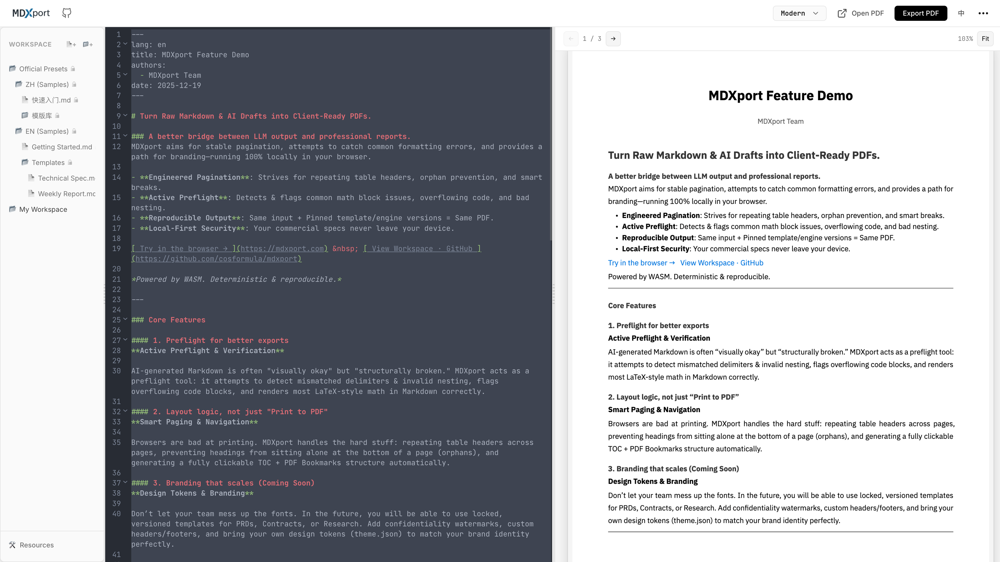
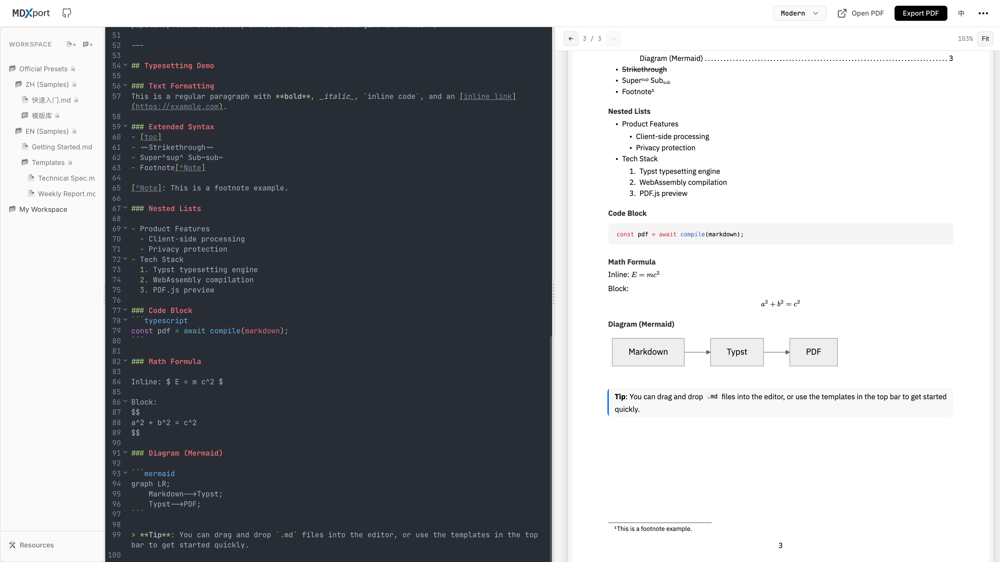

<p align="center">
  
</p>

# MDXport

**Markdown to PDF, Perfect Typesetting.**

MDXport is a powerful Markdown export tool built with [Svelte](https://svelte.dev/) and [Typst](https://typst.app/). It allows you to convert Markdown into high-quality, business-ready PDFs directly in your browser.

## ✨ Features

- **Typst-Powered**: Leverages the power of Typst for professional-grade typesetting.
- **Privacy-First**: Runs entirely client-side using WebAssembly. Your data never leaves your browser.
- **Real-time Preview**: Live side-by-side preview of your Markdown and the rendered PDF.
- **Smart Formatting**: Automatically fixes common AI-generated Markdown issues like table overflows and hierarchy errors.
- **Rich Syntax Support**:
  - 📊 **Mermaid** diagrams
  - 📐 **Math** formulas (LaTeX syntax)
  - 💻 **Syntax Highlighting** for code blocks
  - 📑 **Auto-generated Table of Contents**
- **No Setup**: No installation or account required. Just open and use.

## 📸 Screenshots

<p align="center">
  
  <br>
  <em>Split-screen editing with real-time PDF preview</em>
</p>

<p align="center">
  
  <br>
  <em>Rich support for Math, Mermaid diagrams, and Charts</em>
</p>

## 🚀 Quick Start

Visit [mdxport.com](https://mdxport.com) to start using it immediately.

### Local Development

If you want to run MDXport locally:

1. **Clone the repository**
   ```bash
   git clone https://github.com/cosformula/mdxport.git
   cd mdxport
   ```

2. **Install dependencies**
   ```bash
   npm install
   ```

3. **Start the development server**
   ```bash
   npm run dev
   ```

4. **Build for production**
   ```bash
   npm run build
   ```

## 🛠️ Tech Stack

- **Framework**: [Svelte 5](https://svelte.dev/)
- **Typesetting**: [Typst](https://typst.app/) via WASM
- **Markdown Handling**: [unified](https://unifiedjs.com/) ecosystem (remark)
- **PDF Preview**: [PDF.js](https://mozilla.github.io/pdf.js/)
- **Icons**: [Lucide](https://lucide.dev/) (via SVG)

## 📄 License

This project is licensed under the [MIT License](LICENSE).

---

[中文说明 (Chinese README)](README_zh.md)
