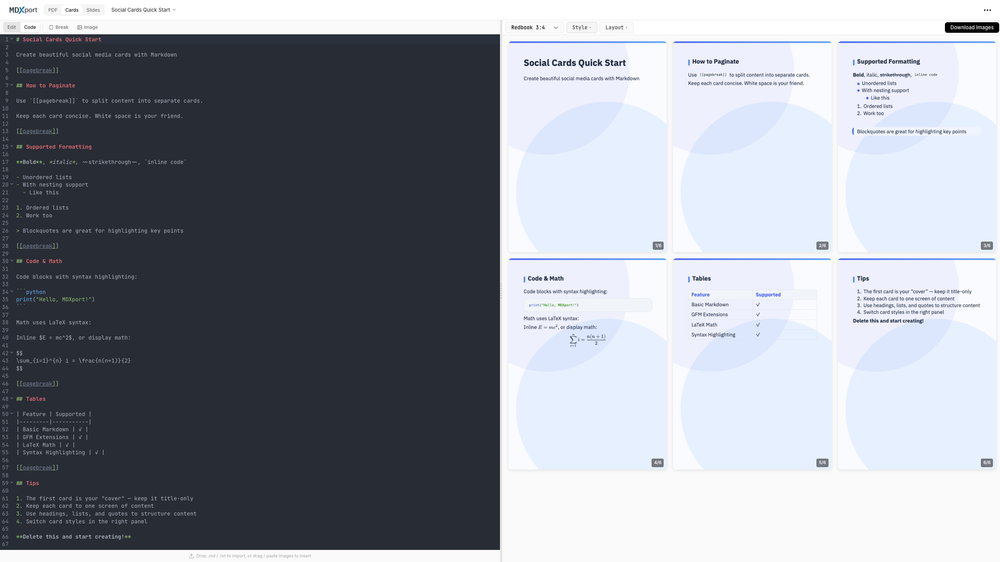
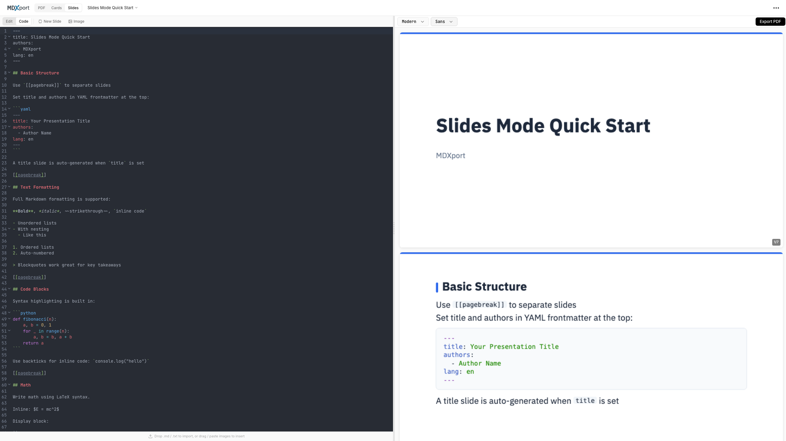

<p align="center">
  
</p>

# MDXport

**Markdown to PDF, Cards & Slides — Perfect Typesetting.**

MDXport is a powerful Markdown export tool built with [Svelte](https://svelte.dev/) and [Typst](https://typst.app/). Convert Markdown into professional PDFs, Xiaohongshu (小红书) image cards, and presentation slides — all directly in your browser with zero setup.

## ✨ Features

### Three Export Modes

- **PDF Documents** — Professional-grade PDF export with multiple styles (modern-tech, classic-editorial) and built-in templates for technical specs, weekly reports, and more.
- **Xiaohongshu Cards** — Export beautiful social media cards as PNG images. 7 card styles (clean, knowledge, dark, minimalist, modern, forest, blueprint) with customizable theme colors, sizes, and content density.
- **Presentation Slides** — Create slide decks from Markdown. 3 themes (modern, dark, minimal) with PDF export.

### Editing

- **Dual Editor Modes** — Switch between a code editor and a WYSIWYG rich-text editor (powered by [Milkdown](https://milkdown.dev/)).
- **Real-time Preview** — Live side-by-side SVG preview as you type, rendered directly from Typst with pixel-perfect accuracy.
- **Page Breaks** — Use `[[pagebreak]]` to control pagination across all modes.
- **Image Upload** — Embed images directly into your documents.

### Rich Syntax

- 📊 **Mermaid** diagrams
- 📐 **Math** formulas (LaTeX syntax, auto-converted to Typst)
- 💻 **Syntax Highlighting** for code blocks
- 📑 **Auto-generated Table of Contents**

### Built-in Templates

Each mode comes with ready-to-use templates to help you get started quickly — from technical documentation to knowledge-sharing cards to tech talks.

### More

- **Document Management** — Create, save, and organize multiple documents. Auto-saves to IndexedDB so your work persists across sessions.
- **Smart Formatting** — Automatically fixes common AI-generated Markdown issues like table overflows and heading hierarchy errors.
- **Typst-Powered** — Leverages Typst for professional-grade typesetting.
- **Privacy-First** — Runs entirely client-side using WebAssembly. Your data never leaves your browser.
- **Bilingual** — Full English and Chinese interface.
- **No Setup** — No installation or account required. Just open and use.

## 📸 Screenshots

<p align="center">
  
  <br>
  <em>Split-screen editing with real-time PDF preview</em>
</p>

<p align="center">
  
  <br>
  <em>Export Markdown as beautiful social media cards</em>
</p>

<p align="center">
  
  <br>
  <em>Create presentation slides from Markdown</em>
</p>

<p align="center">
  
  <br>
  <em>Rich support for Math, Mermaid diagrams, and Charts</em>
</p>

## 🚀 Quick Start

Visit [mdxport.com](https://mdxport.com) to start using it immediately.

### Local Development

1. **Clone the repository**
   ```bash
   git clone https://github.com/cosformula/mdxport.git
   cd mdxport
   ```

2. **Install dependencies**
   ```bash
   npm install
   ```

3. **Start the development server**
   ```bash
   npm run dev
   ```

4. **Build for production**
   ```bash
   npm run build
   ```

## 🛠️ Tech Stack

- **Framework**: [Svelte 5](https://svelte.dev/)
- **Typesetting**: [Typst](https://typst.app/) via WASM
- **WYSIWYG Editor**: [Milkdown](https://milkdown.dev/) (Crepe)
- **Markdown Handling**: [unified](https://unifiedjs.com/) ecosystem (remark)
- **Preview Rendering**: [typst.ts](https://github.com/nicholasgasior/typst.ts) renderer (SVG)
- **Icons**: [Lucide](https://lucide.dev/) (via SVG)

## 🔗 Related Projects

- [mdxport-cli](https://github.com/cosformula/mdxport-cli) - A fast, single-binary CLI for Markdown to PDF conversion. Install via `npm install -g @mdxport/cli`.
- [markdown2typst](https://github.com/Mapaor/markdown2typst) - A standalone npm package for Markdown to Typst conversion by [@Mapaor](https://github.com/Mapaor).

## 📄 License

This project is licensed under the [MIT License](LICENSE).

---

[中文说明 (Chinese README)](README_zh.md)
